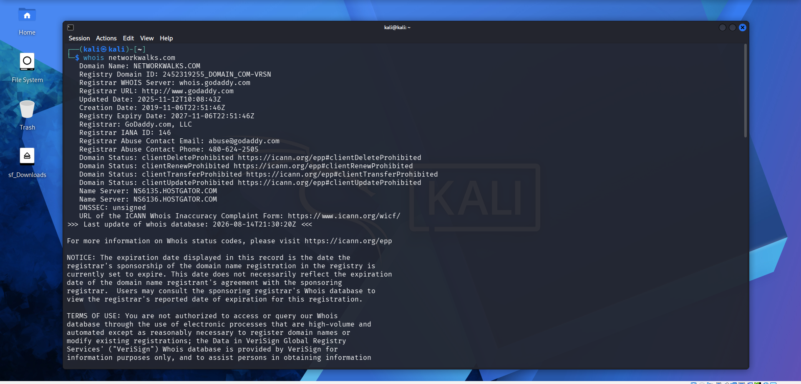
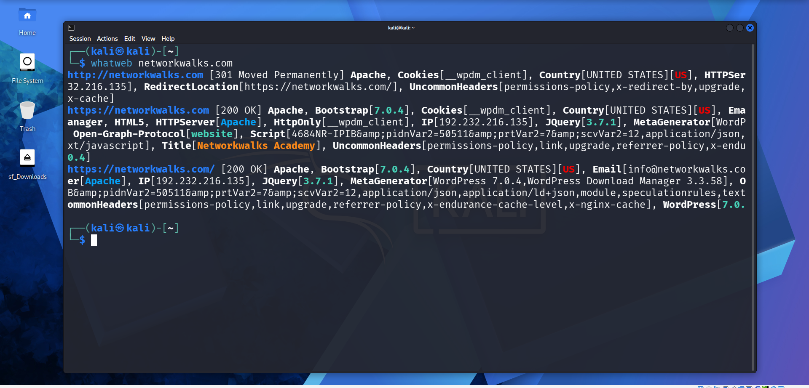
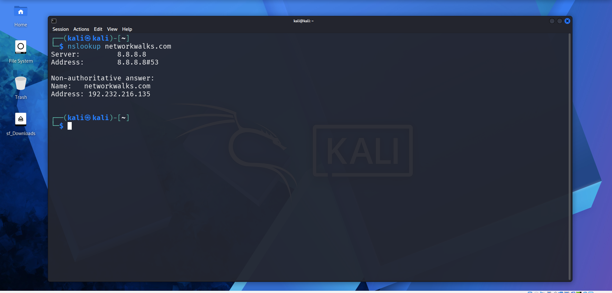
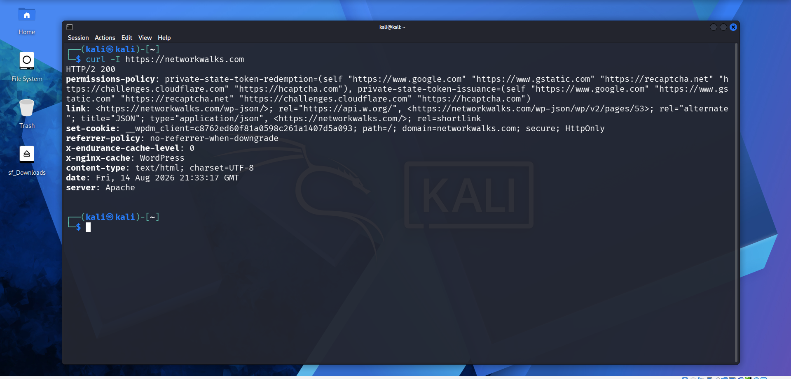
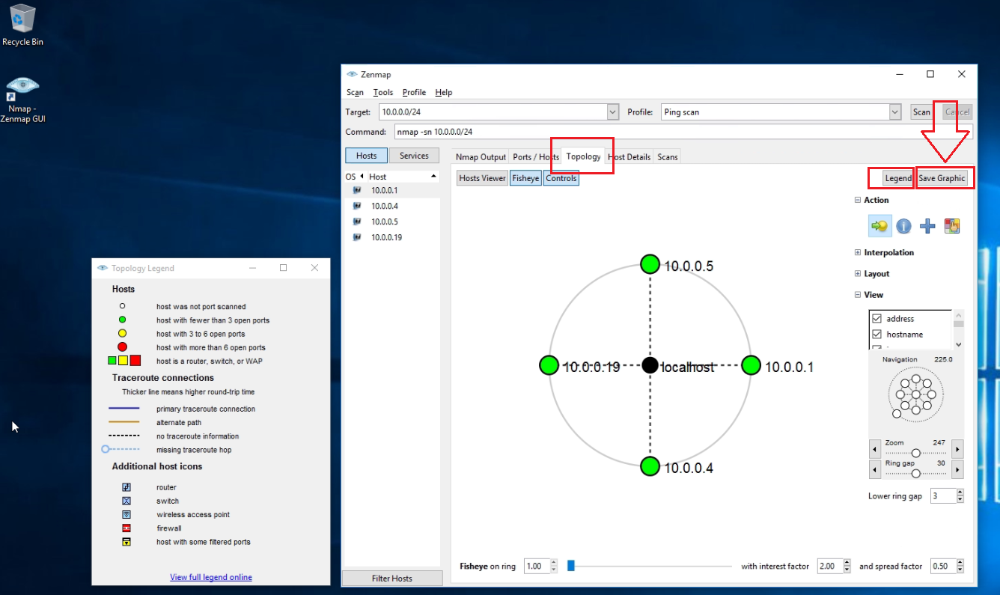

# 🔐 Penetration Testing Report — Footprinting & Network Scanning

Week 02 cybersecurity practical covering **footprinting & reconnaissance** of the Networkwalks domain and **network discovery** of an authorized local LAN using Kali Linux and Zenmap.

* * *

## 📌 Project Overview

This project documents the Week 2 practical activities completed during the Networkwalks cybersecurity program.

The assessment covered two main areas:

- **W2-PM1 — Multiple Kali Tools:** footprinting and reconnaissance of `networkwalks.com` using WHOIS, WhatWeb, Nslookup, Curl, Wafw00f and DNSRecon.
- **W2-PM5 — Zenmap Scanning:** discovery of live hosts on the author's own local network using Zenmap/Nmap.

The activities were performed only on systems where written permission had been secured or on systems owned by the author.

* * *

## 🎯 Objectives

The main objectives of this project are to:

- Perform authorized footprinting and reconnaissance against the assigned target.
- Collect publicly available domain, DNS, HTTP and technology information.
- Identify web technologies and WAF information exposed by the target.
- Resolve the domain name to its IP address.
- Review HTTP response headers and exposed API information.
- Enumerate DNS records.
- Identify live hosts on an authorized local LAN with Zenmap.
- Document observations, potential impact and security recommendations.
- Maintain evidence screenshots for each practical activity.

* * *

## 🛡️ Scope & Authorization

| 🧩 Item | ⚙️ Details |
|---|---|
| 👤 Pentester / Author | Iniyan Inbaraj Swamickan |
| 🧑‍💻 Program / Batch | B083-Networkwalks |
| 📅 Date | 18 September 2026 |
| 🎯 Client / Target | Networkwalks — written permission secured |
| 🌐 Additional target | Author's own local LAN network |
| ✅ Permission secured | Yes |
| 🧭 Phase 1 | Reconnaissance & Footprinting |
| 🧭 Phase 2 | Scanning & Network Discovery |
| ⏳ Remaining phases | Phase 3–5 in progress |

> ⚠️ **Authorization:** The activities were performed only on systems/devices where written permission had been secured or that were owned by the author. Do not reuse the commands or target information against unauthorized systems.

* * *

## 🧰 Tools Used

| 🛠️ Tool | 🎯 Purpose |
|---|---|
| Kali Linux & Windows | Operating systems used for reconnaissance and scanning |
| WHOIS | Find domain registration details, dates and name servers |
| WhatWeb | Fingerprint web technologies, server, CMS, plugins and IP information |
| Nslookup | Resolve the domain name to an IP address using DNS |
| `curl -I` | Inspect HTTP response headers |
| Wafw00f | Detect whether a Web Application Firewall protects the site |
| DNSRecon | Enumerate DNS records such as NS, MX, SPF/TXT and SRV records |
| Zenmap (Nmap GUI) | Scan the local subnet and identify live hosts, IPs and MAC addresses |
| Windows CMD | Identify local IP and MAC address information |

* * *

# 🪜 Pentesting Procedure

## Step 1. WHOIS Reconnaissance

WHOIS was used to obtain publicly available domain registration information and identify the target domain's name servers.

### Evidence



* * *

## Step 2. WhatWeb Technology Fingerprinting

WhatWeb was used to identify technologies exposed by the website. **WordPress 7.0.4** and **WP Download Manager 3.3.58** were identified, along with additional information exposed by the site.

### Evidence



* * *

## Step 3. Nslookup DNS Resolution

Nslookup was used to resolve the domain name to an IP address. `192.232.216.135` was observed as the resolved address.

### Evidence



* * *

## Step 4. Curl HTTP Header Inspection

`curl -I` was used to inspect HTTP response headers. The response exposed the WordPress REST API endpoint `/wp-json/`.

### Evidence



* * *

## Step 5. Wafw00f WAF Detection

Wafw00f was used to determine whether a Web Application Firewall was protecting the site. **ModSecurity (SpiderLabs)** was identified.

### Evidence


* * *

## Step 6. DNSRecon DNS Enumeration

DNSRecon was used to enumerate DNS infrastructure information including name servers, mail servers and DNS/service-related records such as SPF/TXT and SRV data.

> DNSRecon was used to enumerate the DNS information described above. No separate DNSRecon screenshot is included in the evidence set.

* * *

## Step 7. Zenmap Local Network Discovery

Zenmap was used for network discovery on the author's local network. The practical required identifying the local IP/subnet, discovering live hosts, collecting IP/MAC information and creating a topology view.

The example results identify these four live hosts:

```text
10.0.0.1
10.0.0.4
10.0.0.19
10.0.0.5
```


### Host Discovery Evidence


### Topology Evidence



* * *

# 🔎 Key Observations

| # | 🔍 Risk / Finding | 🧾 Evidence / Observation | 🎯 Potential Impact | 📊 Risk Level |
|---|---|---|---|---|
| 1 | Web technology information exposed | WhatWeb identified WordPress and WP Download Manager | Exposed technology/version information may help identify software requiring further security review | Medium |
| 2 | Server IP address identifiable | Nslookup resolved the domain to `192.232.216.135` | Provides information about the network location of the web service | Low |
| 3 | HTTP technical information exposed | Curl returned response headers and exposed `/wp-json/` | May assist technology fingerprinting and further enumeration | Low |
| 4 | WAF technology identifiable | Wafw00f identified ModSecurity (SpiderLabs) | Reveals information about the web application's security architecture | Low |
| 5 | DNS infrastructure information exposed | DNSRecon identified DNS, mail and service-related records | DNS information can help build a broader infrastructure profile | Medium |
| 6 | Multiple live hosts visible on local network | Zenmap identified four live hosts in the example network | Unknown or unauthorized devices may potentially be present on a network | Medium |

> These are **observations from footprinting and scanning, not confirmed vulnerabilities**. No exploitation or vulnerability validation was performed during these two modules.

* * *

# 🛠️ Recommendations

1. **Review publicly exposed technology information** — regularly review information exposed about web technologies, the CMS and plugins.
2. **Keep software updated** — regularly update CMS platforms, plugins and other web technologies and review current security advisories.
3. **Review HTTP headers** — check HTTP response headers for unnecessary technical information.
4. **Review DNS records regularly** — verify that only required DNS information and services are publicly exposed.
5. **Properly configure and monitor the WAF** — keep the existing ModSecurity WAF enabled and tuned.
6. **Perform regular internal network discovery** — periodically scan authorized internal networks to identify active devices.
7. **Investigate unknown devices** — investigate and verify any unexpected device discovered during network scanning.
8. **Maintain network documentation** — keep network topology and device information current.
9. **Perform security testing with authorization** — conduct reconnaissance and scanning only where appropriate authorization has been provided.

* * *

# 💡 What I Learned

Through this Week 2 project, I learned how to use multiple reconnaissance tools and how each tool provides a different type of security-relevant information.

### 1. Footprinting & Reconnaissance

WHOIS can provide domain information, WhatWeb can identify web technologies, Nslookup can resolve domain names, Curl can inspect HTTP headers, Wafw00f can identify a WAF, and DNSRecon can provide additional DNS information.

### 2. Network Scanning

Zenmap can be used to discover active hosts on an authorized local network and collect IP/MAC address information before generating a network topology view.

### 3. Risk Documentation

Technical findings should be documented by explaining what was performed, what was discovered, what the observation means, what risk it may create, and what can be done to reduce that risk.

### 4. Authorized Testing

Reconnaissance and scanning must remain inside an authorized scope. These activities were conducted as part of an educational cybersecurity lab exercise.

* * *

# 🔐 Security & Ethical Use

This project is intended for cybersecurity education and authorized security testing only.

- Test only systems and networks where you have written permission or ownership.
- Do not use the target information in this repository to access unauthorized systems.
- Do not treat an exposed version, IP address, HTTP header or DNS record as proof of a vulnerability.
- Confirm any suspected vulnerability through separate, authorized security testing before classifying it as a confirmed vulnerability.

* * *

# 👤 Author

Iniyan Inbaraj Swamickan  
Cybersecurity Professional B083

LinkedIn: https://www.linkedin.com/in/iniyan-swamickan-9a21aa22/

* * *

## 📌 Project Information

Program Name: Cybersecurity program at Networkwalks | Week: 02 | Modules: W2-PM1 (Multiple Kali Tools) + W2-PM5 (Zenmap Scanning) | Repository: GitHub

## About

Week 2 penetration-testing practical covering footprinting, reconnaissance and local-network discovery using Kali Linux tools and Zenmap within an authorized scope.
